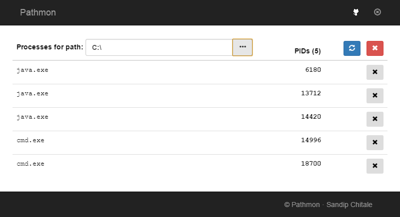

# What is Pathmon ?

Pathmon is a simple electron based Path monitor (for windows only). On windows, this uses Microsoft Sysinternals utility handle.exe utility which needs to run as Administrator.

## Screenshot



## Using Pathmon

```
git clone https://github.com/sandipchitale/epathmon.git
cd epathmon
npm install
# Download and install Microsoft Sysinternals utility handle.exe and put it in js/ folder
# Start a command window in administrative mode and then run
npm start
```

## To build executable

```
npm install electron-packager -g

npm run package:win
```

You can create a shortcut to the executable and then set the shortcut to Run as Administrator using the Properties > Advanced ... . That way you can direclty click on the shortcut.
